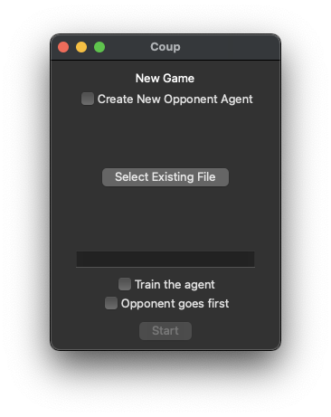
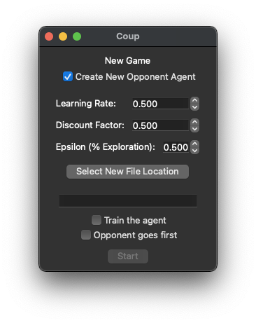
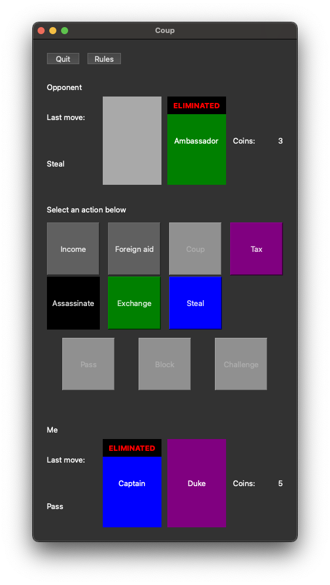
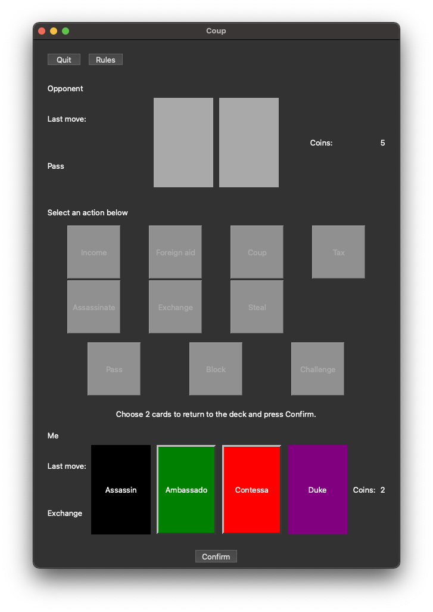

# Coup RL Desktop App

The Coup RL desktop app allows humans to play against an RL agent.
You can choose to train the agent through your games, or play with an agent trained through some other method.

## Usage
```bash
$ python app/main.py
```
First, make your selections on the main menu.
- When creating a new agent:
    - File location to save to
    - Learning Rate
    - Discount Factor
    - Epsilon
- When using an existing agent:
    - Existing agent file location
- Whether to train the agent (whether the value function will be saved with updated values after this game or not)
- Which player has the first turn  



After pressing start, the game will begin. You'll see your opponent on the top and your information on the bottom. For both players you can see the cards, the last move they took, and the number of coins they have. The opponent's cards stay hidden until they have been eliminated. 

Between the two players is a list of actions you can take. Invalid actions are grayed out depending on the state of the game. For example, below I don't have 7 coins, so the Coup action is grayed out.

Play the game by selecting a valid action.


Some actions require the selection of 1 or more of your cards and pressing the confirm button.
